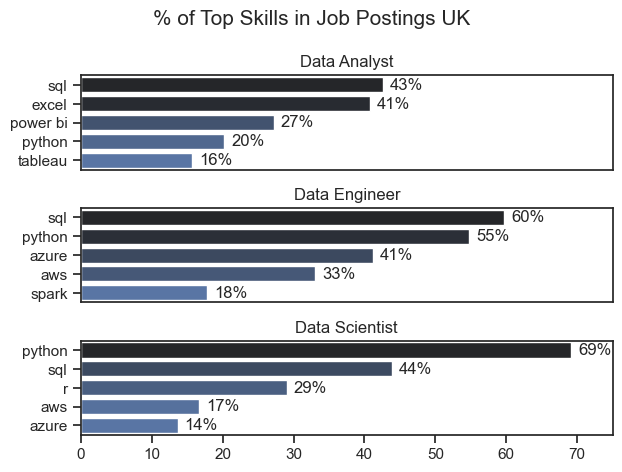
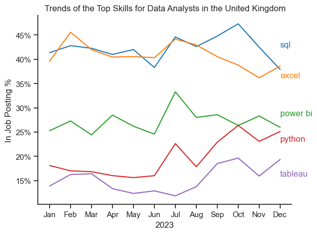
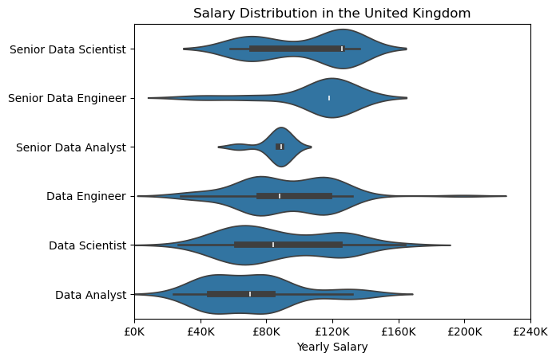

# The Analysis

## 1. What are the most demanded skills for the top 3 most popular data roles?
To find the most demanded skills for the top 3 most popular
data roles, I filtered out those positions by which ones were the most popular, and got the top 5 skills for these top 3 roles. This code highlights the most popular data job titles and their top skills, showing which skills you should pay attention to depending on the role you're targeting.

View my notebook with walkthrough notes here:

[2_skills_counting.ipynb](3_Project\2_skills_counting.ipynb)


### Visualisation Code
---
```python
fig, ax = plt.subplots(len(job_titles), 1)
sns.set_theme(style='ticks')
for i, job_title in enumerate(job_titles):
    df_plot = df_skills_perc[df_skills_perc['job_title_short'] == job_title].head(5)
    sns.barplot(data=df_plot, x='skill_perc', y='job_skills', ax=ax[i], hue='skill_perc', palette='dark:b_r')
    ax[i].set_title(job_title)
    ax[i].set_ylabel('')
    ax[i].set_xlabel('')
    ax[i].legend().set_visible(False)
    ax[i].set_xlim(0, 75)
    
    for y, x in enumerate(df_plot['skill_perc']):
        ax[i].text(x + 1, y, f'{x:.0f}%', va='center')

    if i != len(job_titles) -1:
        ax[i].set_xticks([])

fig.suptitle('% of Top Skills in Job Postings UK', fontsize=15)
fig.tight_layout()
plt.show()
```

### Results
---



### Insights
---
#### **Data Analyst**

Key Skills:
- SQL (43%) and Excel (41%) dominate, showing a strong need for database management and spreadsheet analysis in data analyst roles.

- Power BI (27%) and Tableau (16%) emphasize the importance of data visualization skills in presenting insights.

- Python (20%) is a usefull skill but is less critical compared to visualization and database tools.

Insight: Data Analysts are expected to have a mix of foundational database, spreadsheet, and visualization skills, with less emphasis on advanced programming.

### **Data Engineer**

Key Skills:
- SQL (60%) and Python (55%) are critical, reflecting the role's focus on handling large-scale data pipelines and integrations.

- Cloud skills such as Azure (41%) and AWS (33%) are also prominent, showing the industry's shift toward cloud infrastructure.

- Spark (18%) highlights the demand for big data processing in this role.

Insight: Data Engineers require expertise in database management, programming, and cloud technologies, with a focus on handling complex data architectures.


### **Data Scientist**

Key Skills:
- Python (69%) leads by a wide margin, reflecting its essential role in machine learning, data modeling, and statistical analysis.

- SQL (44%) remains important for querying and managing data. R (29%) is notable, indicating its use in statistical analysis alongside Python.

- AWS (17%) and Azure (14%) suggest some overlap with cloud-based solutions but are less emphasized compared to engineering roles.

Insight: Data Scientists prioritize advanced programming, statistical tools, and some database skills, with minimal emphasis on cloud platforms.

## 2. How are in-demand skills trending for Data Analysts?

To find out how the most in-demand skills for data analysts are trending, I filtered the data to show on data analyst jobs, found the top 5 skills and then grouped them by the month of which the jobs were posted. This code highlights the trends of how often different skills are asked for in data analyst job postings throughout 2023.

View my notebook with walkthrough notes here:

[3_skill_trends.ipynb](3_Project\3_skill_trends.ipynb)


### Visualisation code
---
```python
df_plot = df_perc.iloc[:, :5]
sns.set_theme(style='ticks')
sns.lineplot(data=df_plot, dashes=False, palette='tab10', legend=False)
for i in range(5):
    plt.text(11, df_plot.iloc[-2, i], df_plot.columns[i], color=sns.color_palette('tab10')[i])
sns.despine()
ax = plt.gca()
ax.yaxis.set_major_formatter(PercentFormatter(decimals=0))
plt.title(f'Trends of the Top Skills for {job_title}s in the {job_place}')
plt.ylabel('In Job Posting %')
plt.xlabel('2023')
plt.show()
```

### Results
---



### Insights
---
- SQL (47.3% in October, ~42% average): SQL is consistently the most demanded skill across the months. Its dominance highlights the critical importance of database querying and management for data analysts.

- Excel (45.6% in February, ~40% average): Excel remains a close second. Demonstrating its importance for spreadsheet analysis and data organization.

- Power BI (33.3% in July, ~27% average): Power BI saw notable growth in the summer months, this reflects the increasing reliance on business intelligence tools for visualization and reporting.

- Python (26.4% in October, ~21% average): Python’s demand rises steadily throughout the year, signifying its role in automation, data analysis, and programming.

- Tableau (19.7% in October, ~15% average): Tableau maintains a smaller but steady demand. It is a complementary skill for data visualization alongside Power BI.

Insight:
The trends highlight that SQL and Excel remain foundational for data analyst roles, emphasizing database management and spreadsheet expertise. Meanwhile, the increasing demand for Power BI and Python suggests a shift toward data visualization and programming skills. Tableau is valuable but plays a more niche role compared to Power BI. Data analysts aiming to remain competitive should focus on mastering SQL, Excel, and Power BI, with growing attention to Python for automation and advanced analytics.


## 3. How much do different data job titles pay?


intro

View my notebook with walkthrough notes here:
[4_salary_analysis.ipynb](3_Project\4_salary_analysis.ipynb)

### Visualisation Code
---
```python
sns.violinplot(data=df_uk_top6, x='salary_year_avg', y='job_title_short', density_norm='width', order= job_order)
plt.title(f'Salary Distribution in the {job_place}')
plt.xlabel('Yearly Salary')
plt.ylabel('')
ax = plt.gca()
ax.xaxis.set_major_formatter(plt.FuncFormatter(lambda x, pos: f'£{int((x*0.8)/1000)}K'))
plt.xlim(0, 300_000)
plt.show()
```

### Results
---


### Insights
---

blah blah blah


## 4. What are the highest paid and most wanted data skills?


intro
is in the same notebook as before

## Visualisation Code

```python
fig, ax = plt.subplots(2, 1)

sns.set_theme(style='ticks')

sns.barplot(data=df_da_top_pay, x='median', y=df_da_top_pay.index, ax=ax[0], hue='median', palette='dark:b_r', legend=False)
ax[0].set_title(f'Top 10 highest paying skills for {job_title}s')
ax[0].set_ylabel('')
ax[0].set_xlabel('')
ax[0].xaxis.set_major_formatter(plt.FuncFormatter(lambda x, pos: f'£{int((x*0.8)/1000)}K'))
ax[0].tick_params(axis='y', labelsize=12)

sns.barplot(data=df_da_skills, x='median', y=df_da_skills.index, ax=ax[1], hue='median', palette='dark:b_r', legend=False)

ax[1].set_title(f'Top 10 Most Wanted skills for {job_title}s')
ax[1].set_ylabel('')
ax[1].set_xlabel('Median Yearly Salary')
ax[1].xaxis.set_major_formatter(plt.FuncFormatter(lambda x, pos: f'£{int((x*0.8)/1000)}K'))
ax[1].set_xlim(ax[0].get_xlim())
ax[1].tick_params(axis='y', labelsize=12)

fig.tight_layout()
plt.show()
```

### Results

result


### Insights

boh boh boh

## 5. What are the most optimal skills to learn for a data analyst in the United Kingdom?

intro

notebook

## Visualisation Code

```python
sns.scatterplot(data=df_plot, x='skill_perc', y='median_salary', hue='technology')
sns.set_theme(style='ticks')
sns.despine()
plt.title(f'Most Optimal Skills for {job_title}s in the {job_place}')
plt.xlabel('Percent of Jobs')
plt.ylabel('Average Yearly Salary')
plt.tight_layout()
texts = []
for i , txt in enumerate(df_da_skills_high_demand.index):
    texts.append(plt.text(df_da_skills_high_demand['skill_perc'].iloc[i], df_da_skills_high_demand['median_salary'].iloc[i], txt))
adjust_text(texts, arrowprops=dict(arrowstyle='->', color='grey', lw=1))
ax = plt.gca()
ax.yaxis.set_major_formatter(plt.FuncFormatter(lambda y, pos: f'£{int((y*0.8)/1000)}K'))
ax.xaxis.set_major_formatter(PercentFormatter(decimals=0))
plt.show()
```

## Results

result

## Insights

insights