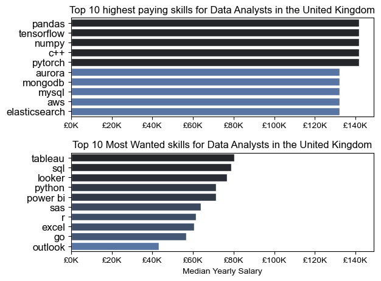
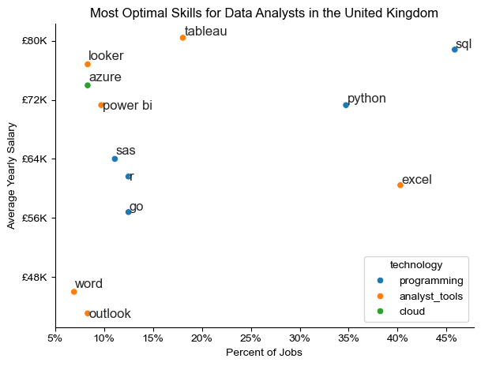

# Overview

Welcome to my analysis of the data job market, with a particular focus on data analyst roles. This project was inspired by the goal of better understanding and navigating the job market. It examines top-paying and in-demand skills, providing insights to help identify optimal career opportunities for data analysts.

The dataset, sourced from [Luke Barousse's job data](https://huggingface.co/datasets/lukebarousse/data_jobs), serves as the foundation for this analysis. It includes comprehensive information on job titles, salaries, locations, and key skills. Using a series of Python scripts, this project addresses critical questions such as the most in-demand skills, salary trends, and the relationship between skill demand and earning potential in the field of data analytics.

# The Questions
Below are the questions I wanted to answer in this project:

1.  What are the most demanded skills for the top 3 most popular data roles in the United Kingdom?
2. How are in-demand skills trending for Data Analysts in the United Kingdom?
3. How much do different data job titles pay in the United Kingdom?
4. What are the highest paid and most wanted data skills in the United Kingdom?
5. What are the most optimal skills to learn for a data analyst in the United Kingdom?

# Tools I Used
For my analysis of the data job market, I made use of several key tools:

- **Python:** The backbone of the analysis allowing me to find key insights through the use of scripts. Within python I frequently used the following libraries: Pandas, Matplotlib and Seaborn.
- **Jupyter Notebooks:** The tool used to run my python scripts, allowing easy inclusion of notes and analysis.
- **Visual Studio Code:** Also used for executing python scrips
- **Git and Github:** Used for version control and sharing my project.

# Data Preparation and Cleanup
The following steps were taken to prepare the data for analysis, ensuring accuracy and usability.

### Import
I start by importing the following libraries for use within the scripts.
```
import pandas as pd
from datasets import load_dataset
import matplotlib.pyplot as plt
from matplotlib.ticker import PercentFormatter
import ast
import seaborn as sns
from adjustText import adjust_text
```

### Load Data and Cleanup
Next the data will be loaded and cleaned.
```
#Data Load
dataset = load_dataset('lukebarousse/data_jobs')
df = dataset['train'].to_pandas()

#Data Cleanup
df['job_posted_date'] = pd.to_datetime(df['job_posted_date'])
df['job_skills'] = df['job_skills'].apply(lambda x: ast.literal_eval(x) if pd.notna(x) else x)
```
This code will load the data and then convert the 'job_posted_date' into a date time format this allows for easier date-related operations like sorting, filtering by date range, or performing calculations. The code also converts the 'job_skills' from a string into a list, so that these skills can be more easily manipulated.

### Additional
 ```
 job_title = 'Data Analyst'
 job_place = 'United Kingdom'
```
Often I will use these variables to name the job title and country, this allows for easy changes to be made if I would want to perform the same analysis on any other job title or country.
# Dataset

The data set used in this analysis contains job posting's of data jobs from all around the world during 2023. The Salaries are originally all in $USD but my visualisations have been converted into £GBP using the current exchange rate as of December 18th 2024 ($1 = £0.8), therefore the salaries may differ slightly based on when you are reading this.
# The Analysis

## 1. What are the most demanded skills for the top 3 most popular data roles?
To find the most demanded skills for the top 3 most popular
data roles, I filtered out those positions by which ones were the most popular, and got the top 5 skills for these top 3 roles. This code highlights the most popular data job titles and their top skills, showing which skills you should pay attention to depending on the role you're targeting.

View my notebook with walkthrough notes here:

[2_skills_counting.ipynb](3_Project/2_skills_counting.ipynb)


### Visualisation Code
---
```python
fig, ax = plt.subplots(len(job_titles), 1)
sns.set_theme(style='ticks')
for i, job_title in enumerate(job_titles):
    df_plot = df_skills_perc[df_skills_perc['job_title_short'] == job_title].head(5)
    sns.barplot(data=df_plot, x='skill_perc', y='job_skills', ax=ax[i], hue='skill_perc', palette='dark:b_r')
    ax[i].set_title(job_title)
    ax[i].set_ylabel('')
    ax[i].set_xlabel('')
    ax[i].legend().set_visible(False)
    ax[i].set_xlim(0, 75)
    
    for y, x in enumerate(df_plot['skill_perc']):
        ax[i].text(x + 1, y, f'{x:.0f}%', va='center')

    if i != len(job_titles) -1:
        ax[i].set_xticks([])

fig.suptitle('% of Top Skills in Job Postings UK', fontsize=15)
fig.tight_layout()
plt.show()
```

### Results
---


### Insights
---
#### **Data Analyst**

Key Skills:
- **SQL** (43%) and **Excel** (41%) dominate, showing a strong need for database management and spreadsheet analysis in data analyst roles.

- **Power BI** (27%) and **Tableau** (16%) emphasize the importance of data visualization skills in presenting insights.

- **Python** (20%) is a useful skill but is less critical compared to visualization and database tools.

**Insight:** Data Analysts are expected to have a mix of foundational database, spreadsheet, and visualization skills, with less emphasis on advanced programming.

### **Data Engineer**

Key Skills:
- **SQL** (60%) and **Python** (55%) are critical, reflecting the role's focus on handling large-scale data pipelines and integrations.

- Cloud skills such as **Azure** (41%) and **AWS** (33%) are also prominent, showing the industry's shift toward cloud infrastructure.

- **Spark** (18%) highlights the demand for big data processing in this role.

**Insight:** Data Engineers require expertise in database management, programming, and cloud technologies, with a focus on handling complex data architectures.


### **Data Scientist**

Key Skills:
- **Python** (69%) leads by a wide margin, reflecting its essential role in machine learning, data modeling, and statistical analysis.

- **SQL** (44%) remains important for querying and managing data. **R** (29%) is notable, indicating its use in statistical analysis alongside Python.

- **AWS** (17%) and **Azure** (14%) suggest some overlap with cloud-based solutions but are less emphasized compared to engineering roles.

**Insight:** Data Scientists prioritize advanced programming, statistical tools, and some database skills, with minimal emphasis on cloud platforms.

## 2. How are in-demand skills trending for Data Analysts?

To find out how the most in-demand skills for data analysts are trending, I filtered the data to show on data analyst jobs, found the top 5 skills and then grouped them by the month of which the jobs were posted. This code highlights the trends of how often different skills are required in data analyst job postings throughout 2023.

View my notebook with walkthrough notes here:

[3_skill_trends.ipynb](3_Project/3_skill_trends.ipynb)


### Visualisation code
---
```python
df_plot = df_perc.iloc[:, :5]
sns.set_theme(style='ticks')
sns.lineplot(data=df_plot, dashes=False, palette='tab10', legend=False)
for i in range(5):
    plt.text(11, df_plot.iloc[-2, i], df_plot.columns[i], color=sns.color_palette('tab10')[i])
sns.despine()
ax = plt.gca()
ax.yaxis.set_major_formatter(PercentFormatter(decimals=0))
plt.title(f'Trends of the Top Skills for {job_title}s in the {job_place}')
plt.ylabel('In Job Posting %')
plt.xlabel('2023')
plt.show()
```

### Results
---


### Insights
---
- **SQL (47% in October, 42% average):** SQL is consistently the most demanded skill across the months. Its dominance highlights the critical importance of database querying and management for data analysts.

- **Excel (46% in February, 40% average):** Excel remains a close second. Demonstrating its importance for spreadsheet analysis and data organization.

- **Power BI (33% in July, 27% average):** Power BI saw notable growth in the summer months, this reflects the increasing reliance on business intelligence tools for visualization and reporting.

- **Python (26% in October, 21% average):** Python’s demand rises steadily throughout the year, signifying its role in automation, data analysis, and programming.

- **Tableau (20% in October, 15% average):** Tableau maintains a smaller but steady demand. It is a complementary skill for data visualization alongside Power BI.

**Insight:**
The trends highlight that SQL and Excel remain foundational for data analyst roles, emphasizing database management and spreadsheet expertise. Meanwhile, the increasing demand for Power BI and Python suggests a shift toward data visualization and programming skills. Tableau is valuable but plays a more niche role compared to Power BI. Data analysts aiming to remain competitive should focus on mastering SQL, Excel, and Power BI, with growing attention to Python for automation and advanced analytics.


## 3. How much do different data job titles pay?


To find out how much different data job titles pay, I filtered the data by the top 6 data job positions in the uk and grouped them to show their average yearly salary. The visualisation was originally going to be a box plot graph but Senior Data Analysts and Engineers had a lack of data compared to others so a violin plot was used instead. This code highlights the min, max, median, frequency as well as the quartile ranges for each jobs yearly salary.

View my notebook with walkthrough notes here:
[4_salary_analysis.ipynb](3_Project/4_salary_analysis.ipynb)

### Visualisation Code
---
```python
sns.violinplot(data=df_uk_top6, x='salary_year_avg', y='job_title_short', density_norm='width', order= job_order)
plt.title(f'Salary Distribution in the {job_place}')
plt.xlabel('Yearly Salary')
plt.ylabel('')
ax = plt.gca()
ax.xaxis.set_major_formatter(plt.FuncFormatter(lambda x, pos: f'£{int((x*0.8)/1000)}K'))
plt.xlim(0, 300_000)
plt.show()
```

### Results
---


### Insights
---


- **Senior Data Scientist (Median: £126K):** Senior Data Scientists command the highest earning potential, with salaries typically concentrated between £100K and £150K. The wide spread reflects variability driven by industry, expertise and location.

- **Senior Data Engineer (Median: £118K):** Similar to Senior Data Scientists, Senior Data Engineers enjoy high salaries, but with a slightly lower peak density. Cloud  expertise and experience in high-demand sectors likely drive higher earnings.

- **Data Scientist (Median: £84K):** Data Scientists earn competitive salaries, with a notable overlap with Data Engineers. Advanced AI/ML skills may provide a higher earning ceiling, particularly in cutting-edge industries like tech or healthcare.

- **Data Engineer (Median: £88K):** Data Engineers have comparable salaries to Data Scientists. The overlap indicates that demand for both roles is equally strong in the UK market.

- **Data Analyst (Median: £70k):** Data Analysts earn the least of the different titles, with most salaries clustering between £40K and £80K. The narrower range indicates less variability, reflecting the roles foundational nature and lower specialization requirements.

- **Senior Data Analyst (Median: £89k):** Senior Data Analysts had more job postings, and therefore earned more consistently than other senior roles, though their earning potential is limited compared to Senior Scientists and Engineers. Advanced analytical skills and leadership responsibilities are key to higher salaries.

**Insight:**
There is a clear salary progression from Data Analyst to Senior Scientist or Engineer roles, with significant earning jumps at each stage. Variability in senior roles highlights the importance of niche expertise, industry, and location. Aspiring professionals should focus on building technical expertise and leadership skills to maximize their earning potential.


## 4. What are the highest paid and most wanted data skills?
To determine the highest paid and most wanted skills I grouped all the skills by their jobs average salary and then created two variables to show the show which skills had the highest salary and which skills were most frequently required.


View my notebook with walkthrough notes here:
[4_salary_analysis.ipynb](3_Project/4_salary_analysis.ipynb)

### Visualisation Code
---

```python
fig, ax = plt.subplots(2, 1)

sns.set_theme(style='ticks')

sns.barplot(data=df_da_top_pay, x='median', y=df_da_top_pay.index, ax=ax[0], hue='median', palette='dark:b_r', legend=False)
ax[0].set_title(f'Top 10 highest paying skills for {job_title}s')
ax[0].set_ylabel('')
ax[0].set_xlabel('')
ax[0].xaxis.set_major_formatter(plt.FuncFormatter(lambda x, pos: f'£{int((x*0.8)/1000)}K'))
ax[0].tick_params(axis='y', labelsize=12)

sns.barplot(data=df_da_skills, x='median', y=df_da_skills.index, ax=ax[1], hue='median', palette='dark:b_r', legend=False)

ax[1].set_title(f'Top 10 Most Wanted skills for {job_title}s')
ax[1].set_ylabel('')
ax[1].set_xlabel('Median Yearly Salary')
ax[1].xaxis.set_major_formatter(plt.FuncFormatter(lambda x, pos: f'£{int((x*0.8)/1000)}K'))
ax[1].set_xlim(ax[0].get_xlim())
ax[1].tick_params(axis='y', labelsize=12)

fig.tight_layout()
plt.show()
```

### Results
---




### Insights
---

#### **Highest Paid**

- **Pandas (£140K Median Salary):** Pandas is the highest-paying skill, underscoring its importance for advanced data manipulation and analysis. Mastery of Pandas is a key driver for higher earnings.

- **TensorFlow (£140K Median Salary):** Expertise in TensorFlow highlights the value of machine learning skills for data analysts, especially in AI-driven industries.

- **NumPy (£140K Median Salary):** NumPy’s high salary association reflects its critical role in numerical computations and data analysis workflows.

- **C++ (£140K Median Salary):** C++ skills are highly valued in specialized roles involving performance optimization and complex computations.

- **PyTorch (£140K Median Salary):** Similar to TensorFlow, PyTorch expertise signals the growing demand for machine learning and deep learning frameworks.

- **Aurora, MongoDB, MySQL (£132K Median Salary):** Database management skills remain lucrative, with Aurora, MongoDB, and MySQL leading among database technologies.

- **AWS and Elasticsearch (£132K Median Salary):** Cloud computing and search engine technologies are in demand, driving competitive salaries for analysts skilled in AWS and Elasticsearch.

#### **Most Wanted**

- **Tableau (£80K Median Salary):** Tableau tops the demand chart, reflecting its widespread use for data visualization. It is a must-have skill for aspiring data analysts.

- **SQL and Looker (£79K and £77K Median Salary):** SQL continues to dominate as the foundational skill for querying databases. Looker’s demand points to the growing emphasis on modern BI tools.

- **Python and Power BI (£71K Median Salary):** Python’s versatility makes it highly sought after, while Power BI remains critical for business intelligence and reporting.

- **SAS and Excel (£64K and £60K Median Salary ):** Despite newer tools, Excel maintains strong demand due to its accessibility, and SAS is valued for statistical analysis in certain industries.

- **R and Go (£62K and £57K Median Salary ):** R is a niche but important tool for statistical computing, while Go’s inclusion reflects the rising intersection of data analytics and software development.

- **Outlook (£43K Median Salary):** Outlook’s presence suggests that even basic office tools are in demand for effective communication and collaboration.

**Insight:**
High-paying skills like Pandas, TensorFlow, and NumPy indicate that technical and machine learning expertise significantly boost earning potential. However, the most wanted skills, including Tableau, SQL, and Python, emphasize core competencies for most data analyst roles. Analysts should balance foundational skills with specialized technical expertise to maximize both job opportunities and salary potential.

## 5. What are the most optimal skills to learn for a data analyst in the United Kingdom?

My definition of an optimal skill is one that is frequently sought after by employers, and is required in jobs with high average salaries. In order to find the most optimal skills I grouped the job skills together to show their average salary and count in job postings. This count was expressed as a percentage out of the total number of jobs in the database. I used an arbitrary number of 6% as the minimum job count percentage to filter out infrequent skills. A for loop was used to find out what type of skill each skill is for better visualisation on the scatter plot.

View my notebook with walkthrough notes here:
[5_optimal_skills.ipynb](3_Project/5_optimal_skills.ipynb)

### Visualisation Code
---

```python
sns.scatterplot(data=df_plot, x='skill_perc', y='median_salary', hue='technology')
sns.set_theme(style='ticks')
sns.despine()
plt.title(f'Most Optimal Skills for {job_title}s in the {job_place}')
plt.xlabel('Percent of Jobs')
plt.ylabel('Average Yearly Salary')
plt.tight_layout()
texts = []
for i , txt in enumerate(df_da_skills_high_demand.index):
    texts.append(plt.text(df_da_skills_high_demand['skill_perc'].iloc[i], df_da_skills_high_demand['median_salary'].iloc[i], txt))
adjust_text(texts, arrowprops=dict(arrowstyle='->', color='grey', lw=1))
ax = plt.gca()
ax.yaxis.set_major_formatter(plt.FuncFormatter(lambda y, pos: f'£{int((y*0.8)/1000)}K'))
ax.xaxis.set_major_formatter(PercentFormatter(decimals=0))
plt.show()
```

### Results
---



### Insights
---

- **SQL (46% of jobs, £79K average salary):** SQL is the most in-demand skill for data analysts in the UK. Its high demand and competitive salary emphasize its importance in database querying and management.

- **Excel (40% of jobs, £60K average salary):** Excel ranks second in demand, underlining its significance in spreadsheet analysis and data organization. However, it offers a lower salary compared to programming languages.

- **Python (35% of jobs, £71K average salary):** Python is a versatile skill with high demand and an impressive salary. It is crucial for automation, data manipulation, and advanced analytics.

- **Power BI (10% of jobs, £71K average salary):** Power BI is a valuable skill for data visualization and business intelligence, providing strong earning potential for professionals skilled in reporting tools.

- **Tableau (18% of jobs, £80K average salary):** Tableau holds steady demand similar to Power BI, making it an essential tool for data visualization roles, though slightly less prominent.

- **SAS and R (<13% of jobs, <£64K average salary):** SAS and R are niche skills often used in statistical analysis. While less in demand, it offers a competitive salary for those jobs that require it.

- **Azure (8% of jobs, £74K average salary):** Cloud expertise, such as Azure, is moderately sought after and reflects the growing integration of cloud technologies in data workflows.

- **Looker (8% of jobs, £77K average salary):** Looker is a specialized BI tool with competitive pay, suited for roles involving advanced reporting and analytics.

- **Outlook and Word (<9% of jobs, <£46K average salary):** These general productivity tools are the least demanded and lowest-paying skills, reflecting their basic utility in data roles.

**Insight:**
SQL and Python are the most optimal for data analyst roles, offering the highest demand and salaries. Excel remains foundational but is often supplemented with more advanced tools like Power BI and Tableau for visualization. Cloud technologies like Azure and specialized BI platforms like Looker are valuable for niche roles. To stay competitive, focus on mastering SQL, Python, and Excel, while building complementary skills in Tableau and cloud platforms.

# What I learned
This was my first python project, therefore I deeply enhanced my knowledge and skills using python. Along with that I bettered my understanding of the data job market.
Some of the main things I learned were:

- **Advanced Python Usage:** Utilizing libraries such as Pandas for data manipulation, Seaborn and Matplotlib for data visualization, and other libraries helped me perform complex data analysis tasks more efficiently.
- **Data Cleaning Importance:** I learned that thorough data cleaning and preparation are crucial before any analysis can be conducted, ensuring the accuracy of insights from the data.
- **Strategic Skill Analysis:** The project emphasized the importance of aligning one's skills with market demand. Understanding the relationship between skill demand, salary, and job availability allows for more strategic career planning in the data industry.

# Insights
This project uncovered several key insights about the data job market for analysts:

- **Correlation Between Skills and Salaries:** There is a clear correlation between the demand for specific skills and the salaries these skills command. Advanced and specialised skills such as Python and Tableau are strongly linked to higher salaries.
- **Evolving Market Trends:** The demand for specific skills is constantly shifting, reflecting the dynamic nature of the data analytics field. Staying updated with these trends is crucial for career progression.
- **Economic Value of Skills:** Identifying skills that are both in high demand and well-compensated can help data analysts prioritize their learning efforts and maximize their earning potential.

# Challenges With This Project
This project was not perfect and gave me a few setbacks, which provided me opportunity for better learning and understanding:

- **Data Inconsistency:** Dealing with missing, inconsistent or duplicate data entries required careful consideration and thorough techniques to ensure the integrity of the insights and analysis.
- **Data Set Limitation:** The data set I was working with primarily included job postings from the United States, although the United Kingdom was still a large portion of the job posting, there was often not enough data to conduct analysis as thoroughly as I would have liked. 
- **Complex Data Visualisation:** Because of the complex nature of the data set, the visualisations I made would need to be equally complex to be able to reveal insights. I learned a lot of new helpful visualisation techniques due to this.

# Conclusion
This deep dive into the data analyst job market has been highly insightful, shedding light on the essential skills and trends driving this dynamic field. The knowledge gained not only improves my understanding but also offers practical guidance for those seeking to grow their careers in data analytics. As the industry evolves, continuous analysis will remain crucial for staying competitive. This project serves as a solid starting point for future investigations and highlights the importance of lifelong learning and adaptability in the data analytics domain.


